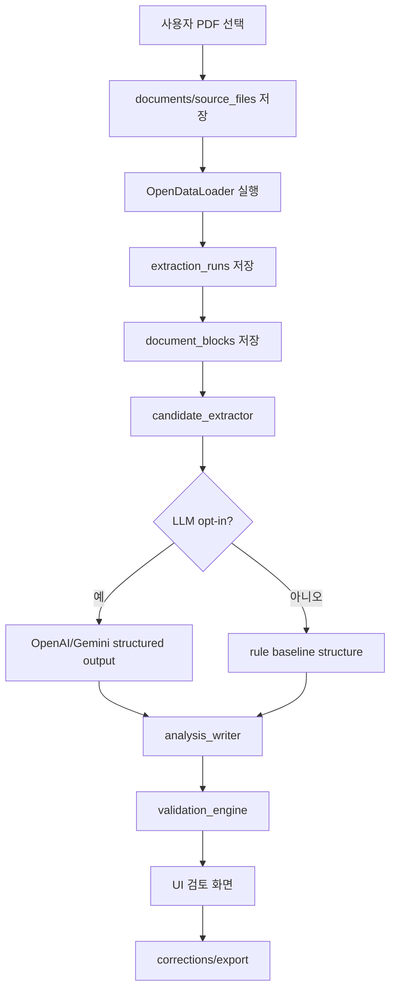

# 아키텍처

## 권장 구조

```text
Tauri frontend
  -> Rust commands
    -> SQLite repository
    -> OpenDataLoader adapter
    -> candidate extractor
    -> LLM adapter
    -> validation engine
    -> export generator
```

프론트엔드는 상태 표시와 사용자 조작을 담당한다. DB 쓰기, 파일 접근, 외부 프로세스 실행, LLM 호출은 Rust command를 통해서만 수행한다.

## 컴포넌트

| 컴포넌트 | 책임 |
|---|---|
| `desktop_ui` | React/Vite 기반 Tauri 화면, 작업 상태, 검토 UI |
| `tauri_commands` | 파일 선택 이후 분석/조회/보정/export 명령 |
| `db` | SQLite migration, repository, transaction |
| `document_ingestion` | 원본 파일 등록, 해시, 중복 확인 |
| `opendataloader_adapter` | OpenDataLoader CLI/sidecar 실행, output 수집 |
| `block_normalizer` | JSON/Markdown을 `document_blocks`로 정규화 |
| `candidate_extractor` | LLM에 보낼 후보 블록 선별 |
| `llm_adapter` | OpenAI/Gemini structured output 호출 |
| `analysis_writer` | 구조화 결과를 domain tables에 저장 |
| `validation_engine` | blocker/warning 생성 |
| `export_generator` | Markdown/JSON/Docx export |

## Tauri 사용 방식

Tauri v2는 프론트엔드가 Rust 함수를 호출하는 command primitive를 제공한다. 긴 작업은 async command와 progress event/channel로 처리한다.

OpenDataLoader는 Python/Java CLI 의존성이 있으므로 Rust가 직접 PDF parsing을 구현하지 않는다. Rust는 shell sidecar 또는 제한된 external command로 OpenDataLoader를 실행하고, output path와 run log만 수집한다.

SQLite는 Rust backend가 소유한다. Tauri SQL plugin은 SQLite 지원이 가능하지만, MVP에서는 프론트엔드 직접 SQL을 열지 않는다. 화면은 Rust command의 typed DTO만 받는다.

## 데이터 흐름



## 모듈 경계

| 경계 | 규칙 |
|---|---|
| UI -> Rust | Tauri command DTO만 사용 |
| Rust -> SQLite | transaction 단위 저장 |
| Rust -> OpenDataLoader | shell/sidecar adapter 뒤에 숨김 |
| Rust -> LLM | provider별 adapter 뒤에 숨김 |
| LLM -> DB | 검증 전에는 확정 테이블에 직접 저장하지 않음 |
| Export -> File | DB snapshot 기반으로 생성 |

## 장애 처리

- OpenDataLoader 실행 실패: `extraction_runs.status = failed`, run log 저장.
- LLM 호출 실패: 기존 extraction 결과는 유지하고 `llm_runs.status = failed` 저장.
- schema validation 실패: LLM raw output은 저장하되 domain write는 차단.
- quality blocker 발생: UI는 `검토 필요` 상태로 표시.
- export 실패: export row에 failed status와 error 저장.

## 참고 자료

- Tauri command: <https://v2.tauri.app/develop/calling-rust/>
- Tauri shell/sidecar: <https://v2.tauri.app/ko/plugin/shell/>
- Tauri SQL SQLite: <https://v2.tauri.app/plugin/sql/>

