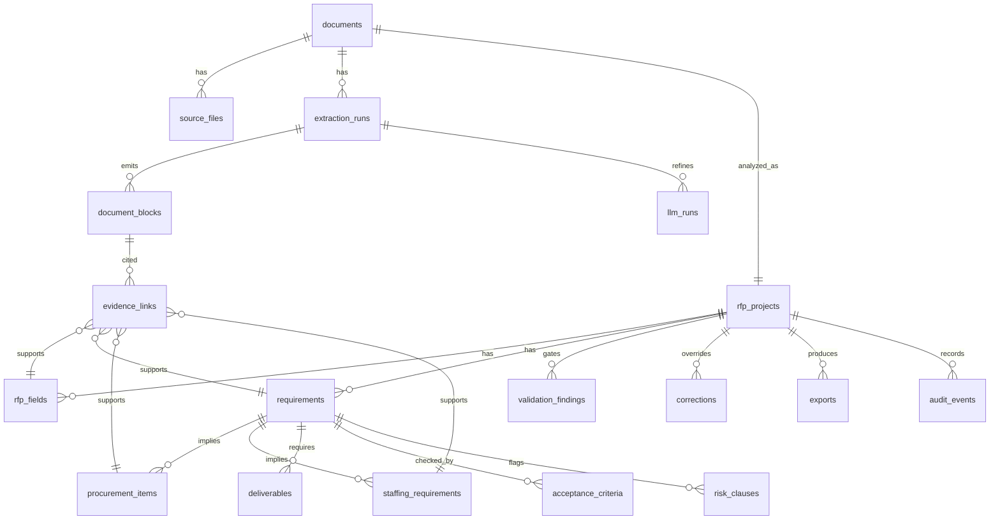

# SQLite ERD

## ERD

## 핵심 테이블

### documents

분석 대상 문서의 논리 단위.

| 컬럼 | 타입 | 설명 |
|---|---|---|
| `id` | TEXT PK | UUID |
| `title` | TEXT | 사용자가 보는 문서명 |
| `created_at` | TEXT | ISO timestamp |
| `updated_at` | TEXT | ISO timestamp |
| `status` | TEXT | `created`, `extracting`, `analyzing`, `review_needed`, `ready`, `failed` |

### source_files

원본 파일과 해시.

| 컬럼 | 타입 | 설명 |
|---|---|---|
| `id` | TEXT PK | UUID |
| `document_id` | TEXT FK | documents |
| `path` | TEXT | 로컬 파일 경로 |
| `file_name` | TEXT | 파일명 |
| `mime_type` | TEXT | 감지된 MIME |
| `sha256` | TEXT | 파일 해시 |
| `size_bytes` | INTEGER | 파일 크기 |
| `created_at` | TEXT | 등록 시각 |

### extraction_runs

OpenDataLoader 실행 이력.

| 컬럼 | 타입 | 설명 |
|---|---|---|
| `id` | TEXT PK | UUID |
| `document_id` | TEXT FK | documents |
| `provider` | TEXT | `opendataloader` |
| `mode` | TEXT | `fast`, `hybrid_auto`, `hybrid_full` |
| `status` | TEXT | `queued`, `running`, `succeeded`, `failed` |
| `json_path` | TEXT | output JSON |
| `markdown_path` | TEXT | output Markdown |
| `stdout` | TEXT | 실행 로그 |
| `stderr` | TEXT | 오류 로그 |
| `started_at` | TEXT | 시작 시각 |
| `finished_at` | TEXT | 종료 시각 |
| `error_message` | TEXT | 실패 사유 |

### document_blocks

OpenDataLoader element 단위.

| 컬럼 | 타입 | 설명 |
|---|---|---|
| `id` | TEXT PK | UUID |
| `extraction_run_id` | TEXT FK | extraction_runs |
| `document_id` | TEXT FK | documents |
| `source_element_id` | TEXT | OpenDataLoader element id |
| `page_number` | INTEGER | 1-based page |
| `block_index` | INTEGER | 앱 내부 순번 |
| `kind` | TEXT | `heading`, `paragraph`, `table`, `list`, `image`, `caption`, `unknown` |
| `heading_level` | INTEGER | heading depth |
| `text` | TEXT | 추출 텍스트 |
| `bbox_json` | TEXT | `[left,bottom,right,top]` |
| `raw_json` | TEXT | 원본 element JSON |

### rfp_projects

RFP 분석 결과의 root.

| 컬럼 | 타입 | 설명 |
|---|---|---|
| `id` | TEXT PK | UUID |
| `document_id` | TEXT FK | documents |
| `analysis_version` | TEXT | schema/prompt/rule 버전 |
| `status` | TEXT | `draft`, `review_needed`, `ready`, `failed` |
| `summary` | TEXT | 짧은 구매 관점 요약 |
| `created_at` | TEXT | 생성 시각 |
| `updated_at` | TEXT | 갱신 시각 |

### rfp_fields

사업 기본정보.

| 컬럼 | 타입 | 설명 |
|---|---|---|
| `id` | TEXT PK | UUID |
| `rfp_project_id` | TEXT FK | rfp_projects |
| `field_key` | TEXT | `business_name`, `client`, `budget`, `period`, `contract_method`, `deadline` |
| `label` | TEXT | 한국어 라벨 |
| `raw_value` | TEXT | 원문 표현 |
| `normalized_value` | TEXT | 표준화 값 |
| `confidence` | REAL | 0.0-1.0 |
| `source` | TEXT | `rule`, `llm`, `correction` |

### requirements

요구사항 root.

| 컬럼 | 타입 | 설명 |
|---|---|---|
| `id` | TEXT PK | UUID |
| `rfp_project_id` | TEXT FK | rfp_projects |
| `requirement_code` | TEXT | `SFR-001` 등, 없으면 generated code |
| `title` | TEXT | 요구사항명 |
| `description` | TEXT | 전체 설명 |
| `category` | TEXT | `functional`, `technical`, `security`, `data`, `staffing`, `management`, `other` |
| `mandatory` | INTEGER | 0/1 |
| `confidence` | REAL | 신뢰도 |
| `source` | TEXT | `rule`, `llm`, `correction` |

### procurement_items

구매/준비해야 할 자원.

| 컬럼 | 타입 | 설명 |
|---|---|---|
| `id` | TEXT PK | UUID |
| `requirement_id` | TEXT FK | requirements |
| `item_type` | TEXT | `hardware`, `software`, `license`, `cloud`, `network`, `database`, `security`, `service`, `other` |
| `name` | TEXT | 항목명 |
| `spec` | TEXT | 스펙 |
| `quantity` | REAL | 수량 |
| `unit` | TEXT | `대`, `식`, `명`, `개월` 등 |
| `required` | INTEGER | 필수 여부 |
| `confidence` | REAL | 신뢰도 |

### staffing_requirements

투입 인력.

| 컬럼 | 타입 | 설명 |
|---|---|---|
| `id` | TEXT PK | UUID |
| `requirement_id` | TEXT FK | requirements |
| `role` | TEXT | PM, PL, 개발자, 보안, DBA 등 |
| `grade` | TEXT | 고급/중급/초급 등 |
| `headcount` | REAL | 인원 |
| `mm` | REAL | MM |
| `onsite` | INTEGER | 상주 여부 |
| `period_text` | TEXT | 투입 기간 원문 |

### deliverables

납품물.

| 컬럼 | 타입 | 설명 |
|---|---|---|
| `id` | TEXT PK | UUID |
| `requirement_id` | TEXT FK | requirements |
| `name` | TEXT | 산출물명 |
| `due_text` | TEXT | 제출 시점 |
| `format_text` | TEXT | 문서/파일 형식 |
| `description` | TEXT | 설명 |

### acceptance_criteria

검수/인수 조건.

| 컬럼 | 타입 | 설명 |
|---|---|---|
| `id` | TEXT PK | UUID |
| `requirement_id` | TEXT FK | requirements |
| `criterion_type` | TEXT | `test`, `performance`, `security`, `inspection`, `sla`, `warranty` |
| `description` | TEXT | 조건 |
| `threshold` | TEXT | 수치 기준 |
| `due_text` | TEXT | 시점 |

### risk_clauses

리스크/독소 조항.

| 컬럼 | 타입 | 설명 |
|---|---|---|
| `id` | TEXT PK | UUID |
| `requirement_id` | TEXT FK | requirements |
| `risk_type` | TEXT | `scope_creep`, `free_work`, `short_schedule`, `liability`, `ambiguous_spec`, `vendor_lock`, `payment`, `security` |
| `severity` | TEXT | `low`, `medium`, `high`, `blocker` |
| `description` | TEXT | 설명 |
| `recommended_action` | TEXT | 검토/질의/가격 반영 조치 |

### evidence_links

추출값과 원문 block 연결.

| 컬럼 | 타입 | 설명 |
|---|---|---|
| `id` | TEXT PK | UUID |
| `document_block_id` | TEXT FK | document_blocks |
| `target_table` | TEXT | 연결 대상 테이블 |
| `target_id` | TEXT | 연결 대상 ID |
| `quote` | TEXT | 짧은 근거 문장 |
| `confidence` | REAL | 근거 연결 신뢰도 |

### llm_runs

LLM 호출 이력.

| 컬럼 | 타입 | 설명 |
|---|---|---|
| `id` | TEXT PK | UUID |
| `extraction_run_id` | TEXT FK | extraction_runs |
| `provider` | TEXT | `openai`, `gemini` |
| `model` | TEXT | 모델명 |
| `schema_name` | TEXT | 사용 schema |
| `prompt_version` | TEXT | prompt 버전 |
| `status` | TEXT | `succeeded`, `failed`, `rejected` |
| `input_token_count` | INTEGER | 입력 토큰 |
| `output_token_count` | INTEGER | 출력 토큰 |
| `request_json` | TEXT | 민감정보 제거 후 저장 |
| `response_json` | TEXT | raw structured output |
| `error_message` | TEXT | 실패 사유 |
| `created_at` | TEXT | 실행 시각 |

### validation_findings

품질 판정.

| 컬럼 | 타입 | 설명 |
|---|---|---|
| `id` | TEXT PK | UUID |
| `rfp_project_id` | TEXT FK | rfp_projects |
| `severity` | TEXT | `info`, `warning`, `blocker` |
| `finding_type` | TEXT | `missing_field`, `missing_evidence`, `zero_requirements`, `invalid_quantity`, `over_extraction` |
| `message` | TEXT | 사용자 표시 메시지 |
| `target_table` | TEXT | 대상 |
| `target_id` | TEXT | 대상 ID |
| `created_at` | TEXT | 생성 시각 |

### corrections

사용자 보정.

| 컬럼 | 타입 | 설명 |
|---|---|---|
| `id` | TEXT PK | UUID |
| `rfp_project_id` | TEXT FK | rfp_projects |
| `target_table` | TEXT | 보정 대상 |
| `target_id` | TEXT | 보정 대상 ID |
| `field_key` | TEXT | 보정 필드 |
| `old_value` | TEXT | 기존 값 |
| `new_value` | TEXT | 새 값 |
| `reason` | TEXT | 보정 사유 |
| `created_at` | TEXT | 생성 시각 |

### exports

내보내기 이력.

| 컬럼 | 타입 | 설명 |
|---|---|---|
| `id` | TEXT PK | UUID |
| `rfp_project_id` | TEXT FK | rfp_projects |
| `export_type` | TEXT | `markdown`, `json`, `docx` |
| `path` | TEXT | 파일 경로 |
| `status` | TEXT | `succeeded`, `failed` |
| `created_at` | TEXT | 생성 시각 |

### audit_events

주요 작업 로그.

| 컬럼 | 타입 | 설명 |
|---|---|---|
| `id` | TEXT PK | UUID |
| `rfp_project_id` | TEXT FK nullable | 프로젝트 |
| `event_type` | TEXT | `document_added`, `extraction_started`, `analysis_completed`, `correction_created`, `export_created` |
| `payload_json` | TEXT | 이벤트 세부 |
| `created_at` | TEXT | 생성 시각 |

## 인덱스

- `source_files.sha256`
- `document_blocks(document_id, page_number, block_index)`
- `rfp_fields(rfp_project_id, field_key)`
- `requirements(rfp_project_id, requirement_code)`
- `evidence_links(target_table, target_id)`
- `validation_findings(rfp_project_id, severity)`
- `corrections(rfp_project_id, target_table, target_id)`

