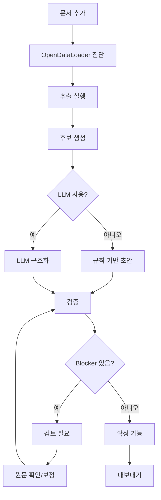

# UI 제품 흐름

## 화면 원칙

v2 첫 화면은 랜딩 페이지가 아니라 작업 화면이다. 사용자는 앱을 열면 바로 RFP를 추가하고 분석 상태를 확인해야 한다.

UI 문구는 한국어를 사용한다. 내부 table/module/API 이름은 영어 식별자를 사용한다.

## 주요 화면

| 화면 | 목적 |
|---|---|
| 문서 작업대 | RFP 추가, 추출/분석 실행, 상태 확인 |
| 분석 개요 | 사업 기본정보와 품질 게이트 |
| 구매 항목 | HW/SW/license/cloud/network/DB/security/service BOM |
| 인력/MM | 역할, 등급, 인원, MM, 상주 여부 |
| 요구사항 | 요구사항 원문, 분류, 근거 |
| 납품/검수 | 산출물, 테스트, 검수, 하자보수, SLA |
| 리스크 | 독소조항, 심각도, 권장 조치 |
| 원문 근거 | page/block/bbox 기반 source viewer |
| 보정 기록 | 사용자가 고친 값과 이유 |
| 내보내기 | Markdown/Docx/JSON 생성 |

## 작업 흐름

## 상태 라벨

| 상태 | 표시 |
|---|---|
| `created` | 문서 대기 |
| `extracting` | 문서 구조 추출 중 |
| `analyzing` | 요구사항 분석 중 |
| `review_needed` | 검토 필요 |
| `ready` | 확정 가능 |
| `failed` | 실패 |

`검토 필요`는 실패가 아니다. 하지만 export에는 품질 경고를 포함해야 한다.

## 분석 개요 화면

상단:

- 사업명
- 발주기관
- 예산
- 기간
- 계약방식
- 요구사항 수
- 품질 상태

품질 상태는 blocker 수와 warning 수를 보여준다.

## 구매 항목 화면

표 컬럼:

- 구분
- 항목명
- 스펙
- 수량
- 단위
- 연결 요구사항
- 리스크
- 근거
- 신뢰도

행 클릭 시 오른쪽 또는 하단에 원문 근거와 관련 요구사항 전체 문장을 표시한다.

## 인력/MM 화면

표 컬럼:

- 역할
- 등급
- 인원
- MM
- 상주 여부
- 기간
- 연결 요구사항
- 근거

## 리스크 화면

표 컬럼:

- 심각도
- 유형
- 설명
- 권장 조치
- 연결 요구사항
- 근거

리스크 유형:

- 범위 확장
- 무상/비용 전가
- 단기 일정
- 책임 과다
- 스펙 모호
- 특정 업체 유리
- 지급/검수 위험
- 보안/개인정보 위험

## 보정 UX

사용자는 모든 추출값 옆에서 `보정`을 누를 수 있다.

보정 dialog:

- 대상
- 필드
- 기존 값
- 새 값
- 사유
- 원문 근거 유지 또는 새 근거 선택

저장 후 화면에는 보정값이 우선 표시되고, 원값은 비교할 수 있어야 한다.

## 내보내기 UX

내보내기 전 품질 상태를 다시 보여준다.

- blocker가 있으면 "검토 필요 상태로 내보내기" 확인 필요.
- ready이면 바로 export 가능.
- export 파일에는 품질 상태와 근거 링크 목록을 포함한다.

